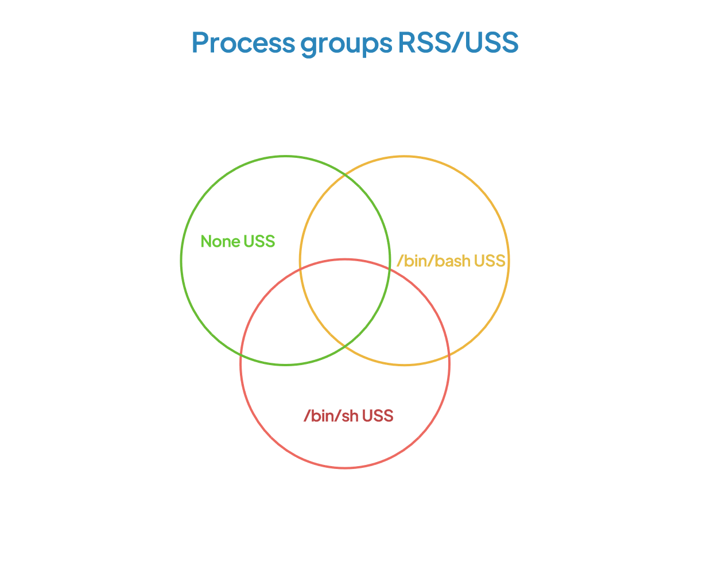

# Linux memory tools

A toolbox to inspect Linux memory

# Small tools
## [shmat](src/bin/shmat.rs)

Attach shared memory segments to current process

## [connections](oracle-tools/src/bin/connections.rs)

Establish lots of connections to Oracle database

## [find_instances](oracle-tools/src/bin/find_instances.rs)

Find Oracle database instances, connect to DB and run some request. Env variables (SID, lib...) and user is found automatically.

## [procinfo](src/bin/procinfo.rs)

Memory map details for single process

# Bigger tools
## [snap.py](proc_snap/README.md)

/proc snapshot tool

## [memstats](src/bin/memstats.rs)

Memory usage for groups of processes. RSS and USS are computed from physical pages allocation, this is not a simple sum of each process.

Groups can be created by user, by environment variable, or by user provided PIDs list

Memory usage for my processes (id -u) and root's, grouped by env variable `SHELL`

```
$ sudo ./memstats --filter "or(uid(0),uid($(id -u)))" groups --split-env SHELL
[2023-03-01T23:54:25Z INFO  memstats] Memory limit: 2063 MiB
[2023-03-01T23:54:25Z INFO  memstats] Using 8 threads
[2023-03-01T23:54:25Z INFO  memstats] 
[2023-03-01T23:54:25Z INFO  memstats] Filter excluded 48 processes, 202 processes remaining
[2023-03-01T23:54:25Z INFO  memstats] 146 kernel processes
[2023-03-01T23:54:25Z INFO  memstats] Scanning 56 processes
[2023-03-01T23:54:25Z INFO  memstats] 
[2023-03-01T23:54:25Z INFO  memstats] Scanned 55 processes in 72.531698ms
[2023-03-01T23:54:25Z INFO  memstats] 1 vanished processes
[2023-03-01T23:54:25Z INFO  memstats::splitters] Split by environment variable SHELL: 18.241642ms
[2023-03-01T23:54:25Z INFO  memstats::splitters] Process groups by environment variable SHELL
[2023-03-01T23:54:25Z INFO  memstats::splitters] group_name                     #procs     RSS MiB     USS MiB
[2023-03-01T23:54:25Z INFO  memstats::splitters] =============================================================
[2023-03-01T23:54:25Z INFO  memstats::splitters] Some("/bin/sh")                     2          26          14
[2023-03-01T23:54:25Z INFO  memstats::splitters] None                               30         108          89
[2023-03-01T23:54:25Z INFO  memstats::splitters] Some("/bin/bash")                  23        2063        2048
[2023-03-01T23:54:25Z INFO  memstats::splitters] Display split by environment variable SHELL: 16.264999ms
[2023-03-01T23:54:25Z INFO  memstats::splitters] 
[2023-03-01T23:54:25Z INFO  memstats] vmhwm = 70468
[2023-03-01T23:54:25Z INFO  memstats] rssanon = 70468
[2023-03-01T23:54:25Z INFO  memstats] vmrss = 74188
[2023-03-01T23:54:25Z INFO  memstats] global_elapsed = 107.808383ms
```

### How it works
1. list all processes
1. exlude kernel processes, exclude processes matching filter
1. For each process, compute the set of pages referenced (via `/proc/<pid>/smaps` and `/proc/<pid>/pagemap`)
1. For each process group, compute the union of sets
1. For each group, compute the difference between this groups' set and others', this gives USS (memory only referenced by processes in this group). RSS is memory referenced by this group that may also be referenced by processes in other groups



### Building

Multiple hash functions can be used. Seems that `fxhash` is the best

features :
* `--features fxhash` (default)
* `--features ahash`
* `--features fnv`
* `--features metrohash`
* `--features std`


Require a fork of procfs until PR 254 is merged (https://github.com/eminence/procfs/pull/254)

To compile for old glibc, install [cargo-zigbuild](https://github.com/rust-cross/cargo-zigbuild)

Via zigbuild
```
arch=x86-64-v2
RUSTFLAGS="-C target-cpu=$arch" cargo zigbuild --release --bin memstats --target x86_64-unknown-linux-gnu.2.12
```

Or if you don't need a portable binary
```
cargo build --release --bin memstats
```

## [processes2png](src/bin/processes2png.rs)

Visual map of processes memory

For details, see [my blog post](https://tatref.github.io/blog/2023-visual-linux-memory-compact/)


